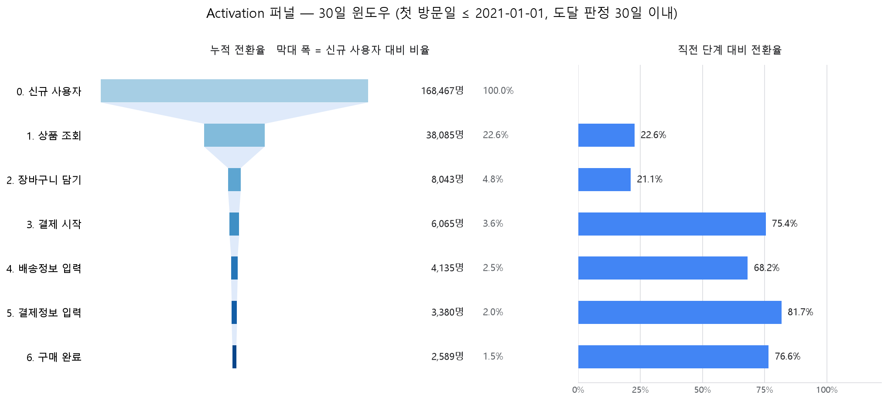

# GA4 이커머스 로그 기반 신규 사용자 유입·전환 분석

Google 머천다이즈 스토어의 GA4 공개 샘플 데이터를 BigQuery와 Python으로 분석한 개인 프로젝트입니다.
신규 사용자가 어디서 들어오고, 구매까지 가는 과정의 어느 구간에서 가장 많이 빠지는지를 확인했습니다.

## 프로젝트 개요

| 항목 | 내용 |
|:---|:---|
| 데이터 | `bigquery-public-data.ga4_obfuscated_sample_ecommerce` (Google이 공개용으로 난독화한 샘플) |
| 분석 기간 | 2020-11-02 ~ 2021-01-31 (13주) |
| 분석 대상 | 기간 내 첫 방문(`first_visit`)이 기록된 신규 사용자 255,369명 |
| 도구 | BigQuery(SQL), Python, Pandas, Matplotlib |
| 형태 | 개인 프로젝트 (2026.07 ~ 2026.10) |

## 핵심 결과

**유입**

- 주별 신규 사용자가 14,591명에서 27,558명까지 약 1.9배 변동했지만, 그동안 채널 구성비의 변동폭은 1.2%p 이내였습니다. 디바이스·대륙·국가 구성비도 거의 그대로였습니다.
- 따라서 이 변동은 특정 채널이나 지역이 아니라 모든 유입 경로에 공통으로 작용한 요인 때문이라고 판단했습니다. 연말 시즌 수요가 가장 유력하지만, 전년 데이터가 없어 확정하지는 않았습니다.
- 채널을 정의하는 과정에서, 자사 도메인에서 넘어온 12,646명이 외부 유입(Referral)으로 분류되어 있는 것을 찾아 직접 유입(Direct)으로 재분류했습니다.

**전환 (퍼널)**

- 첫 방문 후 30일 안에 구매한 신규 사용자는 1.54%였습니다.
- 상품 조회 이후 구간 중 이탈 인원이 가장 큰 곳은 **상품 조회 → 장바구니 담기**(30,042명 이탈)로, 그 뒤 네 구간의 이탈을 모두 합한 것(5,454명)의 약 5.5배입니다.
- 이 구간의 전환율은 디바이스와 유입 채널에 따라 달라지지 않았습니다. 디바이스 간 최대 차이는 0.81%p, 채널 간 최대 차이는 1.46%p였습니다. 이탈이 특정 집단에 몰려 있지 않고 전체에 고르게 퍼져 있다는 뜻입니다.



| 단계 | 사용자 수 | 신규 대비 | 직전 단계 대비 |
|:---|---:|---:|---:|
| 신규 사용자 | 168,467 | 100.0% | |
| 상품 조회 | 38,085 | 22.6% | 22.6% |
| 장바구니 담기 | 8,043 | 4.8% | 21.1% |
| 결제 시작 | 6,065 | 3.6% | 75.4% |
| 배송정보 입력 | 4,135 | 2.5% | 68.2% |
| 결제정보 입력 | 3,380 | 2.0% | 81.7% |
| 구매 완료 | 2,589 | 1.5% | 76.6% |

퍼널 표는 30일을 온전히 관측할 수 있는 사용자(첫 방문일 ≤ 2021-01-01, 168,467명)만 대상으로 한 값입니다.

## 분석 과정

### 1. 유입 분석 — [`A(acquisition).ipynb`](data_analysis/A%28acquisition%29.ipynb)

**질문**: 신규 유입의 급등락은 특정 채널·디바이스·지역에서 온 것인가?

- `traffic_source`의 값 조합을 전부 확인한 뒤 채널 그룹핑 규칙(Organic Search / Direct / Paid Search / Referral / Unassigned)을 정했습니다.
- 급등, 급락, 반등 구간에 대해 가설 5개를 세우고 채널·디바이스·대륙·국가별 주간 구성비로 검증했습니다.
- 5개 가설 모두 기각했습니다. 방문자 수가 1.9배 변하는 동안 모든 축의 구성비가 거의 고정되어 있었습니다.

### 2. 전환(활성화) 분석 — [`A(activation).ipynb`](data_analysis/A%28activation%29.ipynb)

**질문**: 상품을 조회한 사용자는 어느 단계에서 가장 많이 이탈하며, 그 이탈은 특정 집단에 몰려 있는가?

- **퍼널 설계**: 상품 조회부터 구매까지 6단계로 구성하고, 사용자 단위로 집계했습니다. 이벤트가 있었는지만 보지 않고 발생 시각의 순서를 확인해 단계 도달을 판정했습니다.
- **관측 기간 맞추기**: 늦게 유입된 사용자는 구매할 시간이 부족해 전환율이 낮게 잡힙니다. 이 편향을 없애기 위해 모든 사용자에게 첫 방문 후 30일의 같은 관측 기간을 적용했습니다.
- **30일의 근거**: 유입 시기가 같은 사용자 130,824명으로 집단을 고정하고 누적 구매 전환율을 그렸습니다. 30일 시점에 45일까지 관측된 구매의 97.1%가 이미 일어났고, 그 이후 하루 평균 신규 구매자는 절반 이하로 줄었습니다.
- **가설 검증**: 이탈이 가장 큰 조회 → 장바구니 구간에 대해 가설 3개를 검증했습니다.

| 가설 | 판정 | 근거 |
|:---|:---|:---|
| 상품 카테고리에 따라 전환율이 다르다 | 검증 불가 | 상품 422개 중 419개에 카테고리 값이 2종류 이상(평균 8.95종류) 붙어 있어 사용자 단위로도 상품 단위로도 나눌 수 없음 |
| 디바이스에 따라 전환율이 다르다 | 기각 | 디바이스 간 최대 차이 0.81%p (기준 5%p) |
| 유입 채널에 따라 전환율이 다르다 | 기각 | 채널 간 최대 차이 1.46%p (기준 5%p) |

디바이스별·채널별 집계의 합계가 퍼널 수치와 일치하는지 확인해, 퍼널과 같은 사용자를 나눈 결과임을 검증했습니다.

## 분석 범위와 한계

- **유입과 전환까지만 다뤘습니다.** 재방문·매출·추천 단계는 관측 기간이 13주로 짧고, 매출값이 가림 처리되어 있으며, 공유 이벤트가 수집되어 있지 않아 신뢰할 수 있는 결론을 내기 어렵다고 판단해 제외했습니다.
- **난독화된 공개 샘플입니다.** 유입 경로의 18%는 실제 채널을 알 수 없고(Unassigned), 캠페인명과 광고비가 없어 캠페인 단위 성과와 고객 획득 비용은 분석할 수 없습니다.
- **세그먼트별 수치가 이례적으로 고릅니다.** 실제 현상일 수도 있지만, 난독화·샘플링 과정에서 세그먼트 간 차이가 줄었을 가능성을 배제할 수 없습니다.
- **기각은 "5%p 이상의 차이가 없었다"는 뜻입니다.** 1~2%p 수준의 작은 차이까지 없다는 뜻은 아닙니다.
- **이탈의 원인은 특정하지 못했습니다.** 디바이스와 유입 채널로 설명되지 않으므로 모든 사용자가 공통으로 거치는 상품 상세 페이지 쪽이 남은 후보이지만, 이 데이터에는 페이지 구성이나 페이지 안에서의 행동 정보가 없어 직접 확인할 수 없었습니다.

## 저장소 구조

```
data_analysis/
  A(acquisition).ipynb      유입 분석
  A(activation).ipynb       전환(활성화) 분석
  *.png                     노트북에서 생성한 차트
```
